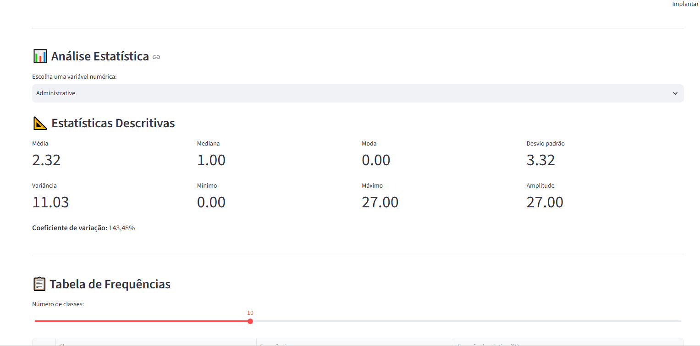
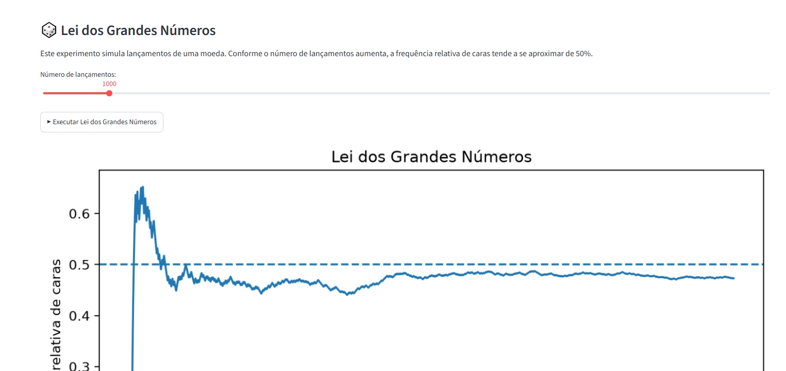
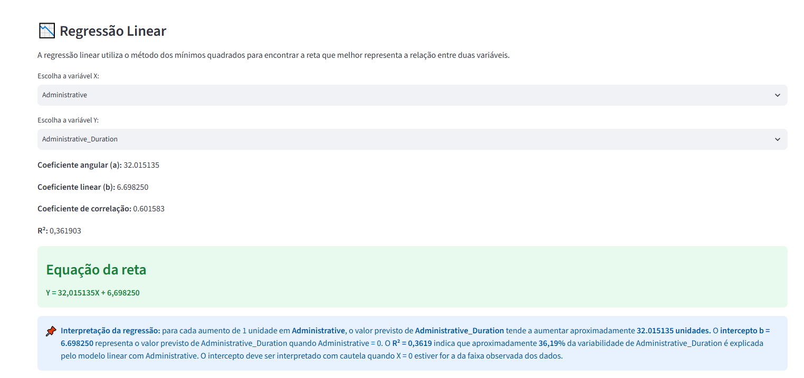
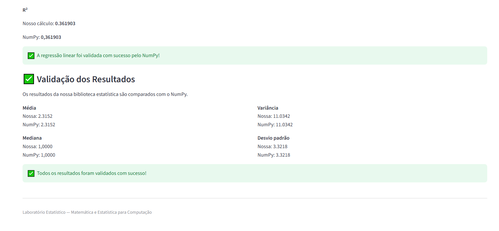

# 📊 Laboratório Estatístico

Projeto desenvolvido para a disciplina de **Matemática e Estatística para Computação**.

O Laboratório Estatístico é uma aplicação interativa desenvolvida em Python e Streamlit para explorar um conjunto de dados real utilizando estatística descritiva, distribuições de probabilidade, simulações, correlação e regressão linear.

---

## 👤 Integrante

**Nome:** Arthur Cardoso Assunção  
**Matrícula:** RA: 72650172

> Caso o projeto possua outros integrantes, adicionar o nome completo e a matrícula de cada integrante nesta seção.

---

## 🎯 Objetivo

O objetivo do projeto é aplicar conceitos matemáticos e estatísticos por meio da programação.

O laboratório permite:

- carregar e explorar dados reais;
- calcular estatísticas descritivas;
- construir tabelas de frequência;
- identificar outliers;
- gerar gráficos;
- analisar distribuições teóricas;
- realizar simulações estatísticas;
- demonstrar a Lei dos Grandes Números;
- demonstrar o Teorema Central do Limite;
- calcular covariância e correlação;
- realizar regressão linear;
- realizar previsões;
- validar cálculos próprios com bibliotecas de referência.

---

## 📂 Conjunto de Dados

Foi utilizado o conjunto:

**Online Shoppers Purchasing Intention Dataset**

O conjunto contém informações sobre sessões de usuários em um site de comércio eletrônico.

Cada registro representa uma sessão de navegação e possui variáveis relacionadas ao comportamento do usuário, como duração de navegação, quantidade de páginas visitadas, taxa de rejeição, taxa de saída e informações relacionadas à realização de uma compra.

O arquivo utilizado pela aplicação possui:

- **12.330 registros**
- **18 variáveis**

Arquivo no projeto:

```text
dados/online_shoppers.csv
```

### Fonte original

**UCI Machine Learning Repository**

https://archive.ics.uci.edu/dataset/468/online+shoppers+purchasing+intention+dataset

---

## 🛠️ Tecnologias Utilizadas

- Python
- Streamlit
- Pandas
- NumPy
- Matplotlib
- SciPy
- Pytest

---

## 🧮 Núcleo Estatístico Próprio

As principais funções estatísticas foram implementadas manualmente em:

```text
src/estatistica.py
```

A biblioteca própria implementa:

- média;
- mediana;
- moda;
- mínimo;
- máximo;
- amplitude;
- variância amostral;
- variância populacional;
- desvio padrão amostral;
- desvio padrão populacional;
- quartis e percentis;
- intervalo interquartil;
- coeficiente de variação;
- covariância;
- correlação de Pearson;
- detecção de outliers;
- tabela de frequências.

O objetivo é realizar os cálculos principais sem depender de funções estatísticas prontas para gerar os resultados apresentados ao usuário.

---

## 📊 Estatística Descritiva Interativa

O usuário pode escolher uma variável numérica e visualizar:

- média;
- mediana;
- moda;
- variância;
- desvio padrão;
- mínimo;
- máximo;
- amplitude;
- coeficiente de variação;
- quartis;
- intervalo interquartil;
- quantidade de outliers;
- tabela de frequências.

A aplicação também apresenta uma interpretação textual automática da distribuição.

---

## 📈 Visualizações

A aplicação possui diferentes visualizações estatísticas:

- histograma;
- boxplot;
- gráfico de barras para variáveis categóricas;
- diagrama de dispersão;
- reta de regressão linear;
- gráficos das simulações.

---

## 📐 Distribuições Teóricas

O laboratório permite comparar os dados observados com distribuições teóricas.

Foram utilizadas:

- Distribuição Normal;
- Distribuição Exponencial.

Os parâmetros são estimados a partir dos dados selecionados e as curvas são apresentadas junto aos histogramas para permitir uma análise visual do ajuste.

---

## 🎲 Probabilidade e Simulação

### Lei dos Grandes Números

A aplicação simula lançamentos de uma moeda.

Conforme a quantidade de lançamentos aumenta, a frequência relativa de caras tende a se aproximar da probabilidade teórica de 50%.

O usuário pode alterar a quantidade de lançamentos.

### Teorema Central do Limite

A aplicação realiza amostragens repetidas de uma variável do dataset e calcula a média de cada amostra.

O usuário pode controlar:

- tamanho da amostra;
- número de repetições.

O histograma das médias amostrais permite observar o comportamento previsto pelo Teorema Central do Limite.

---

## 🔗 Correlação e Covariância

A biblioteca própria implementa manualmente:

- covariância;
- correlação de Pearson.

A aplicação permite selecionar duas variáveis numéricas e analisar a intensidade de sua relação linear.

---

## 📉 Regressão Linear

O laboratório implementa regressão linear simples utilizando o método dos mínimos quadrados.

São apresentados:

- coeficiente angular;
- coeficiente linear;
- equação da reta;
- correlação de Pearson;
- coeficiente de determinação (R²);
- diagrama de dispersão;
- reta de regressão;
- predição interativa.

O usuário pode informar um valor de X e receber a previsão correspondente de Y.

A aplicação também destaca que:

**Correlação não implica causalidade.**

---

## ✅ Validação dos Resultados

Os cálculos desenvolvidos manualmente são comparados com resultados de bibliotecas consolidadas, principalmente NumPy.

A aplicação possui uma seção de validação que compara resultados como:

- média;
- mediana;
- variância;
- desvio padrão;
- correlação;
- coeficientes da regressão linear.

---

## 🧪 Testes Automatizados

O projeto possui testes automatizados utilizando **Pytest**.

Arquivo:

```text
testes/test_estatisticas.py
```

Para executar:

```bash
python -m pytest -v
```

Atualmente, o projeto possui 33 testes automatizados executados com Pytest.

Os testes incluem validações das funções implementadas manualmente com
bibliotecas de referência, utilizando principalmente NumPy e SciPy.

Foi adotada uma tolerância numérica de 1e-6 nas comparações.

Resultado atual:

33 testes aprovados com sucesso.

---

## 📁 Estrutura do Projeto

```text
Laboratorio_Estatistico/
│
├── app.py
├── README.md
├── RELATORIO.md
├── requirements.txt
│
├── dados/
│   └── online_shoppers.csv
│
├── src/
│   ├── estatistica.py
│   ├── graficos.py
│   └── util.py
│
├── testes/
│   ├── conftest.py
│   └── test_estatisticas.py
│
└── imagens/
```

> O ambiente virtual `venv` é utilizado localmente e não deve ser enviado ao repositório.

---

## ⚙️ Instalação

### 1. Clonar o repositório

```bash
git clone https://github.com/arthurcar-eng/Laboratorio_Estatistico.git
```

Entre na pasta:

```bash
cd Laboratorio_Estatistico
```

### 2. Criar ambiente virtual

```bash
python -m venv venv
```

### 3. Ativar o ambiente virtual

No Windows PowerShell:

```powershell
.\venv\Scripts\Activate.ps1
```

### 4. Instalar as dependências

```bash
pip install -r requirements.txt
```

---

## ▶️ Executando a Aplicação

Com o ambiente virtual ativado:

```bash
streamlit run app.py
```

A aplicação será aberta no navegador.

Normalmente o endereço local será:

```text
http://localhost:8501
```

---

## 🧪 Executando os Testes

Execute:

```bash
python -m pytest -v
```

O Pytest executará os testes automatizados presentes na pasta `testes`.

---

## 📸 Capturas de Tela

### Estatística Descritiva



### Distribuições e Simulações



### Regressão Linear



### Validação



---

## 📌 Conclusão

O Laboratório Estatístico demonstra a aplicação prática dos conceitos estudados em Matemática e Estatística para Computação.

O projeto combina implementação matemática própria, exploração de dados reais, visualizações, simulações de probabilidade, distribuições teóricas, correlação e regressão linear.

Os cálculos implementados manualmente podem ser comparados com bibliotecas consolidadas, permitindo verificar a precisão das funções desenvolvidas e relacionar as fórmulas matemáticas com sua implementação computacional.